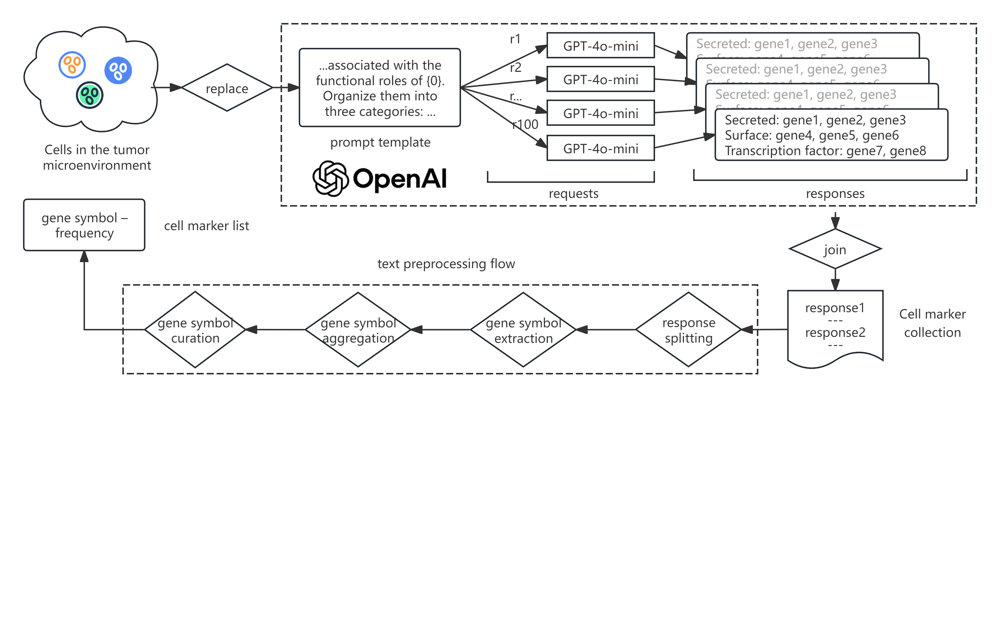

### TMESurv: a tumor microenvironment-informed interpretable neural network for pan-cancer survival analysis

TMESurv is a neural network designed for prognostic survival analysis. In this model, we adopt the tumor microenvironment (TME) as the biological framework for outcome prediction. Because the TME is composed of diverse cell types with distinct functions, these cells play fundamental roles in shaping clinical outcomes. To reflect this complexity, we extended biological information in both upstream and downstream directions to mimic the hierarchical structure of the TME, and we designed a neural network architecture comprising successive layers that represent genes, cellular components, cell types, cell functions, and clinical outcomes.

In the current work, we use OpenAI to extract prior biological knowledge, which is then leveraged to guide the network connection design.  
The overall pipeline is illustrated below:  

The code for this module can be found in the `preprocess` directory.

### Citation
References will be provided here in the final version.

